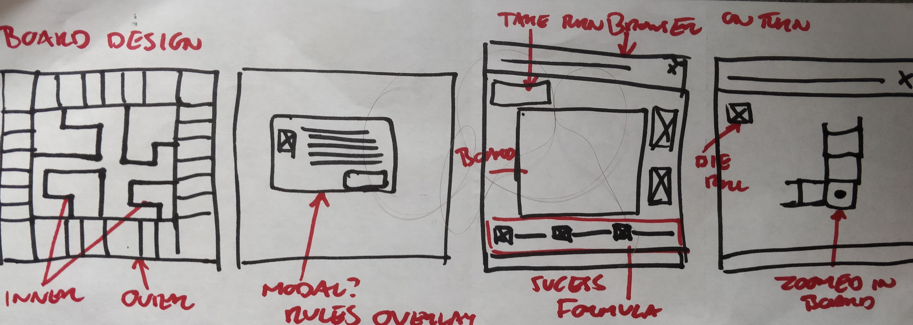
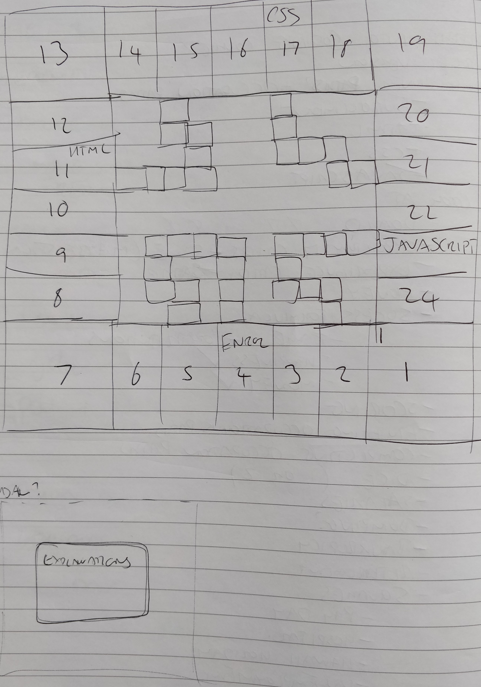
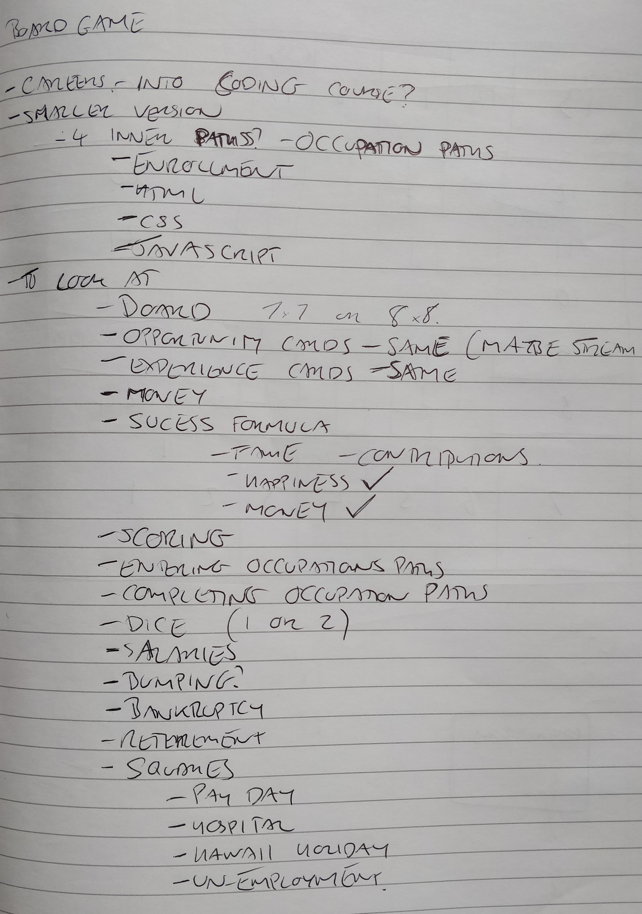
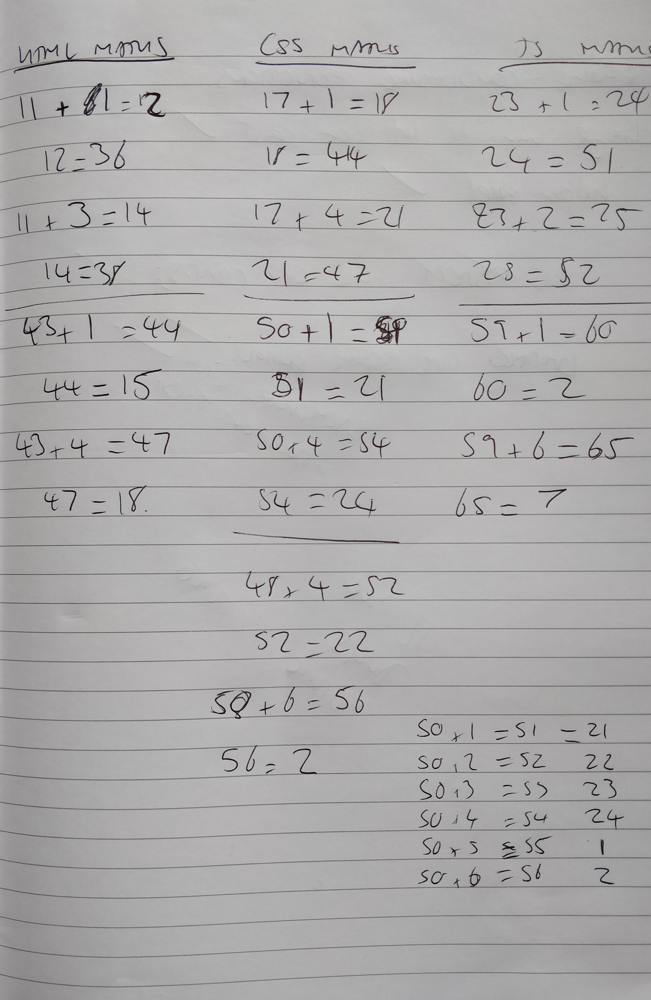

# **Time for a Change**

This is the second milestone project in my Full Stack Web Developer Course. This project is about Interactive Front End Development, and I have chosen to go with a game that will involve a lot of user interaction and decisions.

I decided to go for a board game rather than a memory game in the suggestions, and maybe this was a much bigger task than I imagined. The game is based on a game called careers, that me and my family played a lot when I was growing up, and it involves moving around and earning Money, Fame and Happiness to reach a target. Because of the use of lots of maths, adding and subtracting things, I thought this would be a great way to really get JavaScript involved.

I took this game and added a twist that would set the idea of the game to be based on the Full Stack Web Developer Course. As I have only completed the first half, with front end, I am taking that, from Enrollment and then going through HTML, CSS and JavaScript.

N.B. While there is still things to develop in the future, I have lowered the Success Formula cap from 60 to 30 to give a quicker but more fun gameplay experience.

## **UX**

As this will be a game, the aim of this is for the user to enjoy playing, and maybe get a tiny bit of insight into the path I am going through with changing my career to coding. 

* As a user, I want to enjoy the game and not get easily bored.
* As a user, I want to understand the game easily and know what is happening.

I have made the game use a player, but also 3 computers so that it is more like a normal boardgame with some competition.

### **Wireframes**

I used a bit of time sketching up what i could to how i wanted the game to look as it was only a single page there wasnt a lot of need for design. The main design was the board to get right, along with planning the things to do, and the process of how turns would work. 

## **Features**

### ***Existing Features***

#### Game Intro and Rules
* Rules and Intro come up straight away, using buttons and JavaScript to move between screens.
* Ends on choosing a Sucess Formula consiting of Followers, Money and Happiness. These must add up to 60 and wont let the player go on if it doesn't.
* After the Formula, a player or one of the Computers is chosen at random to go first.

#### Layout of Game screen
##### Board
* Based on a square board that users travel round. 7 x 7 outer grid with 4 smaller paths on the inside. These can be moved through to get extra Money. Happiness and Followers.
* Dice in the middle of the board and a notification for the persons turn that it is.
* Pay button that becomes active on some squares that have the option of paying to move on.
##### Player scores
* A box on the left of the board that shows information for the game play.
* Income - this is the amount of money the player gains when passing Pay Day.
* Sucession Formula. This shows the target that the player has chosen and then the values they currently have.
##### Computer scores
* A box on the right that shows the computers current values. It does not show any targets as this is secret per person so the others done know what they are aiming for. 

#### Gameplay screens
##### Path choosing
* Whilst going round the board, landing on Enrollment, HTML, CSS or JavaScript gives you the option to go on the inner path or stay on the outside path.
##### Outer Square information
* When landing on a space there may be soemthing that happens, a screen pops up to tell you what has been done. 
* Some squares have a choice to make, to stay on them, donate certain money or roll a dice, these options are on the pop up screen

### ***Features Left to Implenment***

* There is a section that i ran out of time to look at, this is the study and focus. There should be requirments to enter each inner path and after getting enrolled you can focus on a certain path. These are recorded and make changes to the game, but i havent had change to look yet.
* Experience cards functionality. After using too much time trying to sort out the Opportunity Cards, I havent had chance to look at the Experience Cards, but these are still to come.
* Computers full turns. At the moment, the computers only move around the outside of the board and do not have all the functions set up to get all the same events as the player. There wasnt enough time to get this really looked into but its a feature I will get sorted soon!
* Squares 6, 16 and 22 had a feature that i havent been able to put in yet. This involves more input from the player to get a desires result.
* When using an opportunity card to move, it still asks if you want to enrol, but moving there means you are enrolling. Doesnt Stop the game at the moment, but would be good to get working in the future.
* Not really a feature, but I spent a lot of time working on the Javascript and the mechanics of the game. Currently the styling does not look as perfect as i would like and uses a lot of standard colours. I ran out of time for submission before being really able to fine tine the colouring and styling. It looks nice now, but the perfectionist in me would really like to make it pop and take it to the next level in the future. 

## Technologies Used

#### [HTML (Hypertext Markup Language)](https://www.w3schools.com/html/)
- HTML is the standard markup language for programmers to use to display content on a webpage.

#### [CSS (Cascading Style Sheets)](https://www.w3schools.com/css/)
- CSS works alongside HTML to add style and effects to the website.

#### [JavaScript](https://www.w3schools.com/js/default.asp)
- JavaScript enables Interactive web pages and is an essential part of web applications.

#### [jQuery](https://jquery.com/)
- jQuery is a framework that enables easier manipulation of the DOM and i have used this to simplifiy the code from standard JavaScript.

#### [Github](https://github.com/)
- A software development sharing platform used for hosting and sharing projects for open source, or team based projects. I was using github so other people can see, its easily hostable and can deploy easily.

#### [Gitpod](https://www.gitpod.io/)
- An IDE (Integrated Development Environment) for GitHub that lets you quickly launch your projects in a ready-to-code environment.

#### [Git](https://git-scm.com/)
- A free and open source version control system that handles all projects and keeps version history in check.

#### [Font Awesome](https://fontawesome.com/)
- A font and icon based toolkit based on CSS - Wikipedia. I used font awesome icons to give a more visual appearance to the Happiness and Followers, it also gave the user a quick viewing of what was being affected. 

#### [Chrome Developer Tools](https://developers.google.com/web/tools/chrome-devtools)
 - A set of Web developer tools built into Google Chrome that allows you to make changes to a website on the fly for testing purposes and be able to diagnose issues. I used this for the console, to be able to view results as changes were made during gameplay. This also allowed me to issue commands to the game to carry on if there was a bug while testing rather than having to start the whole game again.  

## Testing

The testing of this is something i have done constanlty throughout the creation of the game as every square is different and has a different function that determines the action. This game involved a lto fo JavaScript, a new technology to me so I have done constant testing to try and get the correct outcomes, using the console to display values and results as events happened in the game.

I have run the HTML, CSS and Javascript pages through validators with no errors on the HTML. On the CSS the validator is saying that 'backdrop-filter' is not a recognised property, but this is something i have looked into, so i know it exists and it gives the blue effect on the background and not the whole element. There were no errors on that JavaScript apart from some warnings about template literals not being reognised.

Whilst testing I kept a record of things that were going wrong so i didnt forget them. These were stored in the testing.txt file so I could keep looking and notice when i have fixed them. 

#### **Moving around the board**

This was the main thing that required testing throughout. Initially I started with the outer board with just 24 squares and 1 player. This involved finding ways to make the playing piece appear in one div and then move to another. This took a while to figure out but eventually settling on numbers as the ID made it able to use Javascript easily to determine the next square. This movement involved a dice roll, originally this was 2 dice, but this changed to 1 dice as the board wasnt that big and the functionality of 2 dice was more complicated.

The complicated bit of 2 dice was when moving to an inner path, these are between 7 and 10 spaces and a douable 6 would mean bypassing it but trying to figure out the movement sequence. Inner paths were the more complicated bit of the movement. Having played the inspiration boardgame a lot, I knew the functionality of this, but it was more difficult with a grid layout. I managed to get the player moving in and out of the paths with a lot of maths to work out where they should be and what needs to be done. 

 

The difficult bits were coming out of an inner path to the outer and one has 2 different outcomes, as it came out and passed pay day, so went from 50 to 1 which made for a different sum. Testing every single eventuality was not easy so playing this game constantly throughout the development came up with bugs like that. 

#### **Money, Followers and Happiness**

These were the things that let you win when you reach the success formula. The success formula at the start was the first thing, using form inputs and had to add up to 60, so this was tested with various different values to make sure they added up. From my testing any numbers can be put in as long as the 3 fields up to 60.

Most of the testing around these 3 things required moving thorugh the board 1 square at a time and watching the figures change. This helped with testing the movement and the sums with these at the same time. There were times when the end values didnt add up and times when additional things had to be put in such as making sure the money didnt fall below 0, and rounding it to 2 decimal places or there would be a very long number as the result when half or quarter was deducted.

As the board has lots of different possibilities of movement patterns and results, testing the spaces and moving around resulted in lots of different values and made sure that everything added up correctly. The main test with these was to see if the game is won when the player gets to the target and this took a long time, but worked. 

#### **Changing Turns**

With adding in the computers this gave a much better understanding of what things were happening, how it was moving between players. This was what prompted putting in JavaScript SetTimeout on the functions so that moves had a bit of a delay between each one and the player could see what was going on. 

#### **Opportunity Cards**

This was one of the biggest issues with testing and took the most amount of time. The opportunity cards come from an array that the result needed to populate a div with a class relevant to the number in the array. This bit was getting sorted and as the cards would be chosen at random, I could refresh and run the game again, only moving one space to make sure all the cards populated properly.

As the players can use these cards to move to one of the paths or save them, they needed to be added and removed from the Array with the effects of moving working properly. This was not working, with the array being populated fine and removing the card when there was only one in the array I was happy. When adding more cards, upon removing the new one, it would delete all from the array and post a bug in the console. I figured out that this was repeating the removal somehow and falling over once all the cards had been deleted. 

After speaking with my mentor, we came to the conclusion that an object may be easier to let this happen than an array as its easier to add and remove items.

### ***Mentor Advice***

The meetings i had with Gerry were always very helpful. The main thing was about splitting off the Javascript into multiple files to be able to navigate this and not have too much on the page at the same time. 

I have used a lot of Javascript and having over 1000 lines on one sheet was not a good idea. Tidying this up really helped. 

After my struggles with the opportunity cards, Gerry suggested using an object rather than an array as they can be much easier managed.

## **Responsive Design**

As this is a boardgame, I have come to the conclusion very early on that it would not be suitable for mobile devices so I have only built it for desktops. Using a common laptop size as the base, i used viewport width, height and min as the main measurements to easily make the game suit for common laptop and desktop size screens.

## **Bugs and problems**

* Opportunity Cards - This is now working easier and will not stop the game. Using the object was easier than using the array, but it is still removing all the elements in the array rather than just the targetted one. There is going to be functionality to use saved cards, but this is not yet built so it isnt affecting the gameplay.
* Afterm moving space using an Opportunity card, the choose to enrol screen toggles multiple times. This is not a great issue, but if it toggles off the screen, the player will not go inside, but they can still roll and keep moving.
* As mentioned, the validators not recognising the 'backdrop-filter' css property. Not sure what to do about it as its a property and it works? 

## Deployment

I have deployed this using GitHub Pages using the following process;

1. From my github account [https://github.com/mattb0101](https://github.com/mattb0101)
1. New Repository was created, [https://github.com/mattb0101/time_for_change](https://github.com/mattb0101/time_for_change). This was using a template from the Code Institute to build off [https://github.com/Code-Institute-Org/gitpod-full-template](https://github.com/Code-Institute-Org/gitpod-full-template).
1. To be able to view this i had to follow the following steps.
    1. From the Repository, click the setting button.
    1. Scroll down to the Github Pages Section.
    1. Change the source from 'None' to the branch to use. I have been using 'master'.
    1. Scroll back down after saving, and the link will be available. [https://mattb0101.github.io/time_for_change/](https://mattb0101.github.io/time_for_change/)
1. The Code can be run from Github, using Gitpod by pressing the 'Gitpod' button, or cloning, downloading and forking the code. 

## Credits 

### ***Content***
- HTML
- CSS
- Javascript
- [jQuery](https://jquery.com/) used this for a lot of my javascript, lots of use of the documentation on there to use it properly.
- [Font Awesome](https://fontawesome.com/)
- [Google Fonts](https://fonts.google.com/)
- [w3schools](https://www.w3schools.com/) for hints and tips and furthering my knowledge of attributes and elements learnt so far. Two main things were for [Last Child Selector](https://www.w3schools.com/cssref/sel_last-child.asp) and researching [Timing Events](https://www.w3schools.com/js/js_timing.asp)
- [A Codepen piece](https://codepen.io/_Billy_Brown/pen/bzwtJ) That gave me some help and tips and was the basis of making the dice that rolled.
- [Tic Tac Toe](https://www.codeproject.com/Articles/814420/Two-Player-TicTacToe-D-Game-using-jQuery) game that was very useful in helping with working out how to have a game with multiple players in.
- [CSS Tricks](https://css-tricks.com/ids-cannot-start-with-a-number/) to help when I needed my spaces to start with a number but standard CSS script does not let the id be a number, this showed me the way to get that sorted.
- Stack Overflow was the biggest help during some of this project as I had taken on a lot of work that I needed to learn how to do certain things. 
    - [jQuery Refreshing](https://stackoverflow.com/questions/5404839/how-can-i-refresh-a-page-with-jquery) was something I used a lot during testing with quick ability to be able to start the game again with a button.
    - The computers were automated and therefore needed to [auto press buttons](https://stackoverflow.com/questions/18646881/auto-click-button-element-on-page-load-using-jquery), This was pretty helpful with trying to get them working at a decent level. 
    - The [Opportunity and Experience Cards](https://stackoverflow.com/questions/4550505/getting-a-random-value-from-a-javascript-array) were built from Arrays and getting random values from them and populating other arrays. (This may change after speaking with my mentor and saying to use objects as its easier.)
    - [CSS wildcards](https://stackoverflow.com/questions/5110249/wildcard-in-css-for-classes) were something i needed to use for classes and the * didnt work, so this page helped with making any class starting with something.
    - [Diabling and Enabling](https://stackoverflow.com/questions/1594952/jquery-disable-enable-submit-button) buttons with jQuery as i couldnt find this on the jQuery site, but wanted some buttons like the Dice roll button to not always be active.
    - [Set Timeout](https://stackoverflow.com/questions/30107010/jquery-settimeout-function) was a great thing i learnt from this so that the game could be slowed down a bit and function at a pace the eye could see. 
    - [Fieldsets and Legends](https://stackoverflow.com/questions/113640/which-css-tag-creates-a-box-like-this-with-title) was soemthing that I found helpful creating the cards boxes so that the title didnt take up much space and wasnt inside the box and another element needing to be visible. 
    - [Backdrop filter](https://stackoverflow.com/questions/27583937/how-can-i-make-a-css-glass-blur-effect-work-for-an-overlay) This was perfect for the start of the game, it blurred the game behind and gave focus to the rules and intro. **The validator throws an error on this function and says it does not exist. It works perfectly but is not recognised by the CSS validator**
    - [Last item in Array](https://stackoverflow.com/questions/3216013/get-the-last-item-in-an-array) was a big part of trying to sort out the Opportunity cards, but i am not sure it fully works with what i want to do. 

### ***Acknowledgements***
- The game is based on [Careers](https://en.wikipedia.org/wiki/Careers_(board_game)#:~:text=Careers%20is%20a%20board%20game,produced%20by%20Winning%20Moves%20Games.&text=Players%20(from%20two%20to%20six,when%20only%20two%20are%20playing).), a board game published originally by Parker Brothers and most recently by Winning Moves Games.
- My girlfriend Steph for putting up with me through all this but being really positive and supportive of my work. Obviously my cat Kyra....who decides to steal my mouse and re-write the code, but keeping me company most of the day too.
- Other students and tutors on th course, helping and happy to share their projects and support for inspiration and keeping me sane. 
- My mentor Gerry McBride for the support, staying calm which helped me and even through all this current worldwide mess, being really helpful and there when needed even with his own work.